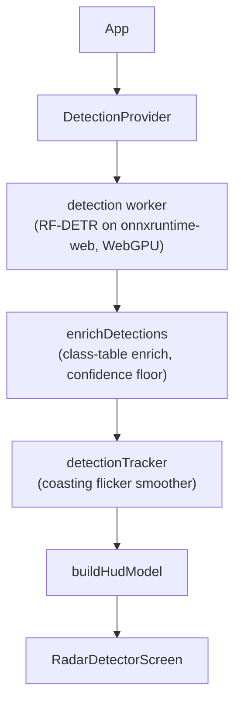

# dashradar: Technical Reference

## 1. What it is

A phone on a dash mount runs object detection on its rear camera and shows a full-screen signal meter styled like a radar detector. The camera feed is never drawn on screen outside a developer-only detection view (§10); a detection adds a small card with a cutout of what was seen. Everything runs in the browser: a Vite React SPA with no backend, no accounts, and no network traffic beyond the app shell and the model weights. It is a computer-vision detector, not a radar detector.

Inference runs in a Web Worker so it never blocks the video element. The app works offline once the model has downloaded, keeps the screen awake while scanning, and stays inside the thermal and battery budget of a phone clamped to a windshield in the sun. Deliberately absent: recording, history, sync, a backend picker (WebGPU or nothing, §2), and confidence numbers in the driver-facing UI. The only state surviving a reload is the cached weights and a small `localStorage` settings object.

## 2. Device support

Target: a modern iPhone on Safari or an Android phone on Chrome, landscape, dash-mounted. Desktop Chrome works for development.

**WebGPU is required and there is no CPU fallback.** Before anything downloads, the worker's `probeWebGpu()` requests an adapter, checks `shader-f16`, and creates a device; any failure raises the terminal `WEBGPU_UNSUPPORTED` before the camera ask and before a single model byte. The int8 CPU build that used to be the fallback measured 10+ second round trips where WebGPU takes about half a second; a detector scanning once every ten seconds misses most of the road, so turning the device away is the honest outcome.

The probe acquires a real device, in the worker scope, because some browsers expose the API on the main thread but not in workers, and some expose it and then fail device creation. It is posted separately from `load` so the verdict never waits behind service-worker control (§11).

`UnsupportedScreen` renders after the intro and before every camera screen. Nothing on it is fixable on the device in hand, so it is a handoff, not an error: it leads with "open it on another phone" and carries the `ShareTarget` cluster (QR plus Web Share). Its tests enforce the copy rules: never name "browser" or "GPU", never say "your phone" (the reader is holding the phone that failed), never ask for a "newer" phone (a current budget phone can fail where an older flagship passes).

## 3. Stack

| Concern | Choice |
| --- | --- |
| App | Vite 8 (Rolldown) + React 19, TypeScript, ESM, static build |
| Detection | `onnxruntime-web` on WebGPU in a Web Worker, hand-rolled preprocess and decode |
| PWA | `vite-plugin-pwa` (Workbox): precached shell, runtime-cached weights and ORT runtime |
| Styling | Tailwind CSS v4 on bespoke elements; Rajdhani the only font; `lucide-react` glyphs |
| Utilities | remeda, including the type guards that validate worker messages |
| Telemetry | Vercel Analytics and Sentry, gated on Do Not Track / GPC, off in dev |
| Tests | vitest + Testing Library (jsdom) |

Commands are in the [README](../README.md). `pnpm check` must pass before a commit.

## 4. Architecture

Everything below the provider is pure: no React, no DOM. Components read `useDetection()` and never touch the worker. Modules are directories named after their primary export (`index.ts` plus optional `consts.ts`, `types.ts`, `tests.ts`); contexts adapt engines to React (`DetectionContext`: a thin adapter over the detection engine; `SettingsContext`: gated settings), `lib/*` holds the React-free domain logic (the detection engine itself, detection filter and HUD shaping, per-result processing, telemetry, tracker, radar signal and audio, camera, crash sentinel, scan clock, and small single-purpose helpers), and `RadarDetectorScreen` is the driver-facing detection UI, with `DetectionView` its developer-only alternative that overlays the model's boxes on the live feed, and `CameraView` holding the hidden `<video>` (visible only through `DetectionView`). Never import `workers/detection/index.ts` from app code (it pulls in onnxruntime-web); import protocol types from `workers/detection/types`.

`useDetection()` hands out the engine's published snapshot (status, download progress, the `HudModel`, `scan` with the frame's raw per-frame detections, the current `contact`, an error code) plus `attachVideo(video)` / `detachVideo()` and `getDebugSnapshot()`. The debug snapshot is read on demand, never published: per-frame timing through state would re-render every consumer for numbers nobody is showing.

## 5. The frame pump

The pump lives in `lib/detectionEngine`, a framework-free module the provider adapts to React through `useSyncExternalStore`. The engine's interface (a snapshot plus subscribe, inputs pushed in) is deliberately implementation-agnostic, so its internals can be rewritten (for example onto a stream library) without touching consumers or the behavioral test suite. Attaching a video begins the loop: wait for a new camera frame (`requestVideoFrameCallback`), capture an `ImageBitmap`, transfer it to the worker; the worker crops, normalizes, infers, decodes, and maps boxes back to full-frame coordinates; on the reply the engine runs `processDetectionResult` (filter, tracker, HUD, crop validation, one pure function with its own tests), then recycles the worker or schedules the next capture. Analytics flow through `lib/detectionTelemetry`, which owns every once-per-load gate, so repeat events from worker recycles cannot re-fire them.

**One frame in flight, latest wins, no queue.** Detection can never outrun the device or back up.

**Pacing.** Captures are at least `MIN_FRAME_INTERVAL_MS` (1 s) apart, and each additionally rests `PACING_REST_RATIO` (1) of the last round trip, so the interval is `max(1 s, 2 x round trip)`: the floor dominates on fast devices, and on slow ones the rest caps the inference duty cycle at 50% and self-corrects, since a throttling phone reports longer round trips and buys itself longer breaks. This floor is the app's main thermal defense; the coasting tracker and peak-hold meter make the slow rate acceptable to look at. Do not lower it without heat and battery testing on a real dash-mounted phone. The developer `throttleInference` off state drops the delay to zero; turning developer options off restores the floor.

**Periodic recycle.** Every `WORKER_RECYCLE_AFTER_MS` (15 min), at a result boundary, the worker is respawned. This bounds native memory JS cannot observe or free (ORT arenas, GPU buffers, the wasm heap), which otherwise grows until iOS kills the page. Weights return from CacheStorage so no download UI flashes; the telemetry sink's one-shot gates keep recycles from re-firing analytics.

**Derived running state.** Whether the pump runs is never commanded, only derived: it runs exactly while a video is attached, the page is visible, and the settings panel is closed (a same-page overlay fires no `visibilitychange`, so it is an explicit input). The provider pushes those inputs; the engine acts on the edges of the derivation, so there is no pause/resume protocol to hold correctly at call sites.

**Race invariants.** One frame in flight (`inFlight`), a generation counter invalidating captures from before a stop, and a `workerLoaded` gate so a recycle's still-loading worker is never handed a frame it would silently drop. Hard-won fixes for real races; understand what each protects before touching them.

## 6. Worker protocol

Both directions are validated by type guards; a malformed message is ignored rather than crashing either side.

| Direction | Message | Purpose |
| --- | --- | --- |
| → worker | `probe` | Can this device run the detector? Downloads nothing; posted ahead of `load` |
| → worker | `load` | Download the given model's weights and create the session (an omitted model loads the default); deferred until service-worker control in production |
| → worker | `detect` | Run one transferred frame, with the cutout flag, zoom, and the effective threshold |
| → main | `model-load-start` | Whether weights came from cache; drives whether the download screen shows |
| → main | `model-progress` | Byte counts while streaming; not sent on a cache hit |
| → main | `model-downloaded` | Weights done, before session build, so download success is counted apart from session failure |
| → main | `backend-probe` | Session error, graph-capture state, isolation, thread count, and what the loaded weights say about themselves; feeds the debug overlay |
| → main | `ready` | Session is live, reporting what the checkpoint turned out to hold (head width, classes) |
| → main | `detections` | Decoded boxes, per-stage timing, optional extras |
| → main | `worker-error` | A typed `DetectionErrorCode` plus optional detail |

The `detections` extra: the **cutout** (top detection's box, padded, clamped, downscaled, never upscaled) is the evidence the contact card shows, requested only while the detection-image setting is on.

`WORKER_CRASHED` is set by the engine from `worker.onerror` for exceptions the worker's try/catch missed. WebKit runs WebGPU in a separate process that can die under a healthy page; the worker awaits `device.lost` once per session and turns it into `GPU_DEVICE_LOST`, ignoring the `"destroyed"` reason (deliberate teardown, not a loss).

## 7. The model

A custom **RF-DETR Small** checkpoint fine-tuned on Las Vegas Metro police vehicles, published at [`tuxracer/las-vegas-metro-rfdetr-small`](https://huggingface.co/tuxracer/las-vegas-metro-rfdetr-small) and exported from a sibling training repo. Signature: input `[1,3,512,512]` fp32 NCHW, ImageNet-normalized; outputs `dets [1,300,4]` (cxcywh, normalized) and `labels [1,300,2]` (raw logits). No NMS; RF-DETR is set-based.

**Default plus stored models.** `src/lib/detectionModels` defines the uniform shape every checkpoint entry takes: Hugging Face `owner`, `slug`, pinned `revision`, and repo-relative `file`. `DEFAULT_MODEL` is the one entry every build ships with (`model_fp16.onnx`, ~57 MB); a developer can register more from the model picker by pasting a Hugging Face URL, and those persist as full entries in `localStorage` under the `models` key. `knownModels()` is the default plus whatever is stored, and is what a selection resolves against: resolving never yields nothing, since an id left by a build that had a model this one does not falls back to the default instead of asking for weights that do not exist. An entry says which bytes to fetch and nothing about what they hold: the head width and the class labels are read off the loaded session and the file's own stamped `names` map (§8), so no table here can drift from the weights it describes. The default keeps a stable id (`las-vegas-metro`) so a routine revision bump still reaches a stored selection; an added model's id is its own pinned weights URL, since nothing else about it is guaranteed stable.

**Adding a model from a URL.** The picker accepts a bare Hugging Face repo page or a `blob`/`resolve` URL pointing at an `.onnx` file. Whatever revision the URL names is resolved to its commit SHA through the Hugging Face API before anything is stored, since the weights cache is keyed on URL and a mutable ref behind it would never update; a tag and a branch look the same in a URL and are both mutable, so only a URL that already names a commit SHA skips the lookup. A bare repo URL also asks the API which `.onnx` file to load, and the add fails if there is none or more than one. Before an entry is stored, a throwaway detection worker gives it a full trial load: download the weights, build a WebGPU session, run it once. That download is the same one that fills the cache, so a successful trial has already cached the weights, and it is the same contract check a real load performs, so an incompatible checkpoint fails in the picker instead of stranding a driver after a reload. Success registers the entry, drafts it as the selection, and shows the classes the checkpoint reported.

**What the file says about itself.** An export can stamp provenance into the ONNX file (release tag, source model id, class names), and onnxruntime-web's JS API surfaces none of it: all a session exposes is its input and output names, types and shapes. `src/lib/onnxMetadata` reads those top-level fields out of the downloaded bytes instead, stepping over the graph by its declared length rather than parsing it, which keeps the read at a fraction of a millisecond on a 57 MB file. The result rides to the debug overlay on `backend-probe` and is the only way to tell which build a device is really running, since the URL says which revision was asked for and not which bytes a cache returned. A build exported before stamping reads fine and reports nothing.

The worker is told which entry to load on the `load` message, because a worker has no `localStorage` of its own to read the selection from. `DetectionContext` resolves it once at mount, hands it to the engine, and exposes it as `activeModel`, so a session and the worker it rebuilds every 15 minutes stay on one model for the whole drive. A new choice applies on the reload the model screen performs when it saves.

**Raw onnxruntime-web, not the Transformers.js pipeline.** The head is a sigmoid scored per class per query, real classes starting at logit index 1 (index 0 is an unused background slot); decode argmaxes each query over the logits the checkpoint names, one label per box. The head width comes from the `labels` output of the run every load already performs, and a `labels` output not shaped like a classification head at all throws `MODEL_LOAD_FAILED`. The pipeline's softmax-with-background decode drops every real detection regardless, and the matching image processor is not a registered JS processor. Any replacement model must be verified end to end in a real browser; there is no second execution path to catch a bad export.

**Mixed precision, GridSample fp32.** The export is fp16 with fp32 I/O and its three GridSample nodes held at fp32, because the WebGPU GridSample kernel emits a WGSL-illegal `f32 * f16` multiply for fp16 tensors and breaks detections silently rather than loudly. Those fp16 tensors are why the probe gates on `shader-f16`. [Models.md](Models.md) carries this and the rest of the contract a replacement model has to meet.

**Graph capture.** Records the first run's kernel dispatches and replays them, cutting the CPU cost of hundreds of small dispatches. On for Chromium, falling back to a plain session on failure; WebKit skips the attempt entirely (`isWebKitUa` in `src/lib/browserEngine`) because measured iPhone round trips are no faster with capture, leaving nothing to weigh against its suspected instability there. It requires the native C++ WebGPU EP, which is why the worker imports `onnxruntime-web/webgpu`: the root import's JSEP registry has no TopK, this graph has one, so under JSEP that node lands on CPU and capture fails deterministically. `ORT_RUNTIME_FILES` in `vite.config.ts` must track the import. An earlier WebKit exclusion was built on crash attribution and lifted when the full data showed nine of ten iOS crashes had capture *off*, all inside the first ~21 s of scanning; the current one rests on the measured no-win instead, and lifting it takes a demonstrated WebKit round-trip improvement.

**Startup sequencing.** Three changes from that crash cluster, all about not stacking peaks: the weights buffer is released before the first run, exactly when ORT allocates every intermediate at once (cache-backed loads only, since only they can reproduce the bytes for the fallback path); the plain session gets a warm-up run on zeroed input before `ready`, so the first-run shader-compilation storm does not land on the first real camera frame; and the camera is acquired only after status leaves `loading-model`, so `getUserMedia` never fires while the session compiles.

## 8. Detection domain

**Class table and threshold.** A class is a logit index and the label the checkpoint gives it. Nothing declares them: the table is built at load from the `names` map stamped into the weights, so the labels and the logits they index always come from one file. It never leaves the worker, since a logit index means nothing anywhere else. A detection travels as the label the checkpoint gave it and is drawn as that label; the HUD's uppercase register is a CSS `text-transform`, not a second string computed and carried alongside the first. A file that names nothing gets generic per-slot labels rather than a failed load, since the meter reads scores and only the words would be missing. The width they are read against is measured off the session's own `labels` output for the same reason.

Everything a checkpoint names is shown. There is no allowlist, which stopped making sense once the checkpoint was trained in-house: discarding a class we deliberately trained is a bug, not a filter. That does mean a new class is live the moment it is named, since `hudSignal` takes the max score across every detection regardless of class. `CONFIDENCE_THRESHOLD` (0.7, near the shipping checkpoint's measured operating point) is applied in the worker's decode and again defensively when detections are enriched; both take it as a parameter, so the developer slider changes both without a worker reload. `SIGNAL_FLOOR` and the value the confidence slider reports while Developer options is off are that constant rather than copies of its number, so neither can drift from the floor the detector actually filters at.

**Coasting tracker.** Shows every detection immediately and only smooths flicker: greedy IoU matching to tracks; a matched track adopts the new box but eases its score toward the new value (damping jitter the meter's floor remap would amplify); an unmatched track coasts a couple of frames; an unmatched detection is visible at once. A pure step function plus a small stateful factory, unit-tested directly.

Zoom (a developer option offering a fixed 1x or 2x crop) is a digital crop, never an upscale: `CAMERA_CONSTRAINTS` asks for ~1024 per axis so the 2x crop lands at 512 native pixels, and any new zoom level must be gated on the granted stream's real dimensions. Native camera zoom is not an option (iOS Safari does not expose it; Chrome Android reports device-defined units). The constraints also cap the frame rate (ideal 15), roughly halving steady capture power against the 30 fps default; not lower, because auto-exposure stretches shutter time toward the frame period and long shutters blur exactly the night frames the model needs sharp.

**HUD shaping.** `buildHudModel` computes `top`, the highest-scoring detection, which the dial's percentage and the status word's class name both read. The contact card and its direction readout instead come from the worker's own score-based pick (`topDetectionIndex`). Both pick by score but read different data, the card the raw detections of the frame just decoded and the dial the coasted tracker set, so they agree on a live frame and drift apart while a track coasts. `mapBoxToViewport`, from the same HUD, maps both `scanRegionBox` (the model's centered crop, narrowed by zoom) and each box for the detection view, assuming `object-fit: cover`.

## 9. UI

One opaque full-screen instrument, dark only, amber the single accent, Rajdhani throughout. Landscape-first, the intro the deliberate exception (a first-time user holds the phone in their hand). No nav, no dialogs.

**The meter** is a tachometer-style arc of ticks around a percentage readout and a status word. While the meter holds a contact the word names the detected class (`<CLASS> DETECTED`), falling back to `ALERT` for a signal with no class to name, and holds that class through the dial's decay tail since the raw signal clears before the peak-held meter does; below `CONTACT_THRESHOLD` it reverts to `SCANNING`. The peak-hold decay, held-label rule, and threshold gates are a pure per-frame step (`stepMeter` in `radarSignal`, unit-tested directly); a `requestAnimationFrame` loop applies it and writes straight to the DOM, so smoothness never depends on the detection rate, and feeds the beeper the *raw* signal rather than the peak-held level, so beeps stop the instant a detection clears while the dial decays behind them. The loop parks itself once the meter is quiescent and is woken by change; while awake, DOM writes are skipped when nothing changed.

**The contact card** sits beside the dial in landscape, below in portrait: a canvas-drawn cutout above a direction row (left / ahead / right), no label or percentage since the dial carries the number. The direction row only renders while the raw signal is nonzero, so a card lingering through the decay tail never shows a stale heading; visibility uses delayed-visibility CSS rather than opacity alone so it stays tappable through the fade-out.

Other surfaces: the status bar (wordmark, settings gear, optional slot for the zoom and round-trip pills), the debug overlay, the model load screen (delayed to avoid a flash; DOWNLOADING and PREPARING phases), the error screens, the camera permission ask (so the browser's own prompt never lands unexplained; the camera is requested only after the ALLOW CAMERA tap), and the intro with its Canvas 2D night-drive scene. Intro dismissal persists as a version number, so bumping the constant walks returning users through a reworked intro once.

## 10. Settings

`localStorage`, validated on read: a corrupt blob falls back to defaults entirely, a partial one fills missing fields from defaults, so a build that adds a field cannot wipe stored values.

`developerOptions` is the master switch. While off, `SettingsProvider` reports every developer option at its off value, so consumers read an already-gated value and never repeat the gate; stored values are untouched, so re-enabling restores prior tweaks. **Turning the switch on reveals rows and nothing else**: every developer option defaults off (a settings-version migration turned off the ones that used to default on). Do not add one that defaults on.

Two driver-facing rows are visible with the switch off: **Audio alerts** gates the beeper (beeping while the dial shows nothing is impossible by construction; the audio floor sits at or above the dial's contact threshold), and **Detection image** (default off) turns the contact card off end to end when disabled: the worker is told not to cut a crop, not just the UI hiding one.

Developer rows with real behavior behind them: **Camera preview** plays a second video element cropped to exactly the scanned region, for checking aim; it defaults off because a second live surface costs compositing on a thermally constrained device. **Detection view** swaps the meter for the live feed with the model's boxes drawn over it, for checking aim and false positives against what the detector actually sees; replacing `RadarDetectorScreen` takes its beeper and contact card off with it too. **Reset app data**, behind a confirm, empties both web storages, deletes every cache and IndexedDB database, unregisters service workers, and reloads, each step settling independently so one failure cannot strand the app half-cleared; it reproduces a genuine first visit on a phone, where devtools are not an option.

## 11. Offline and PWA

Workbox via `vite-plugin-pwa`, registered with `autoUpdate` (silent background updates). Offline works through the **app shell precache** (every built file, including the detection worker's chunk) plus two `CacheFirst` runtime caches: `model-cache` for the weights (the worker streams the download itself to report progress; Hugging Face 302s to a signed CDN URL but Workbox keys on the stable request URL) and `ort-runtime` for the ORT wasm, served same-origin from `/ort/` by a small Vite plugin and fetched on first use rather than precached, to keep ~24 MB out of the service-worker install.

**Model caching pins a revision.** The route is keyed on URL, so the model URL pins an explicit revision, never `main`. To ship a new model: push a new tag, confirm the URL returns 200, bump the revision constant.

**Updates settle before the camera asks.** iOS forgets camera permission between launches of an installed web app, and `autoUpdate`'s reload used to land seconds after the driver answered the prompt, forcing a second answer. `CameraView` now also waits on `waitForUpdateSettled`: an explicit update check that resolves when the launch is current (usually inside the model load, so it costs nothing) and holds while a found update installs, letting the reload arrive first so the driver is prompted once. Both the check and the hold are bounded (`UPDATE_CHECK_TIMEOUT_MS`, `UPDATE_PENDING_TIMEOUT_MS`) and every failure path resolves, so the worst case is the old double prompt, never a stalled startup.

**First-visit caching needs the service worker in control.** The model fetch runs inside the worker, which can start before the service worker claims the page, and that first fetch would bypass the route and store nothing. So `load` waits for `navigator.serviceWorker.controller`, bounded by a short timeout, production only; dev has no service worker, so the worker caches the weights itself into a dev cache. `requestPersistentStorage()` is called on startup so the browser is less likely to evict the weights.

**Cross-origin isolation.** COOP `same-origin` plus COEP `require-corp` (from `vercel.json` in production, Vite config in dev) enables `SharedArrayBuffer`, which lets the ORT wasm runtime run multi-threaded; without it ORT silently clamps to one thread. Inference is on the GPU, but the runtime hosting the WebGPU EP is itself wasm and runs any node the EP cannot take. `require-corp` beat `credentialless` for Safari support, viable because nothing needs an exemption; a cross-origin script or `no-cors` fetch will be blocked.

Verify in a real browser: after a fresh load, Cache Storage holds the precache plus both runtime caches, and an offline hard reload cold-loads the app and runs live inference with no network requests.

## 12. Telemetry

Anonymous, no camera, location, or detection geometry; dev builds emit nothing. With no backend, these events are the only view into whether the app works on real devices. All fire from the worker-message handlers at their source, never from render or state updaters.

| Event | Says |
| --- | --- |
| `intro_start`, `camera_prompt_*`, `settings_open`, `share_click`, `reset` | Funnel and UI steps; `reset` separates a wiped install from a fresh one |
| `model_downloaded` | Weights finished streaming (slug, revision, duration); real downloads only |
| `model_ready` | Session up, and whether from cache; first `ready` of the page load only, so recycles do not re-fire it |
| `first_inference`, `first_round_trip` | End of the funnel: one frame scored, cold |
| `timing_round_trip`, `timing_inference` | Medians once a rolling window fills; what the pacing floor is argued against |
| `timing_*_late` | The same pair after 15 minutes of scanning; the gap is thermal drift on real dash mounts |
| `scan_session` | Actual scan time per drive, bucketed, plus installed-PWA state; the denominator for everything else |
| `wake_lock_failed` | The screen sleeping mid-drive is the app's worst silent failure |
| `pwa_installed` | Chromium's install event, or first standalone launch on iOS |
| `app_updated` | The first launch on a new build, `from` and `to` commit SHA; counts updates that were actually run, not ones downloaded |
| `error` | Every failure that reaches the user, by code |

Timing values are bucketed to the nearest half second so jitter collapses and a series reads as a trend. `scan_session` and the late timings read a clock measuring scanning time, not page time: every pause stops it, and reads claim what they report, so stretches sum to the total with nothing double-counted.

**Crash sentinel.** iOS sometimes kills the page mid-scan with no JS running at kill time, so Sentry never sees it. While scanning, the app writes a heartbeat to localStorage and clears it on every clean exit, including a synchronous `pagehide` path (React never flushes effect cleanups during unload, and the auto-updating service worker reloads sessions routinely). Only a real OS kill leaves a stale record; the next launch classifies it by gap length (short: crash, since iOS relaunches a killed foreground tab within seconds; long: unclean shutdown). The heartbeat runs fast for the first 30 s of scanning and slow after, because every field kill so far landed within ~21 s of the pump starting and a flat slow cadence could not resolve where in startup the page died.

## 13. Error handling

Typed error classes with a machine-readable `code`, never string-matched messages.

**Camera** (`getUserMedia` failures, mapped in `lib/camera`): `NotAllowedError`/`SecurityError` → `PERMISSION_DENIED`; `NotReadableError`/`AbortError` → `CAMERA_IN_USE`; `NotFoundError`, `OverconstrainedError`, and anything else → `NO_CAMERA`; a missing `mediaDevices.getUserMedia` → `UNSUPPORTED`, thrown before any call.

**Detection**: `WEBGPU_UNSUPPORTED` (probe failed; terminal, before any download), `MODEL_LOAD_FAILED` (download or session creation threw; no second backend to retry on), `INFERENCE_FAILED` (one frame threw), `GPU_DEVICE_LOST` and `WORKER_CRASHED` (§6).

Each code maps to a headline, body copy, optional reassurance rows, and a glyph. Every error screen offers a full page reload as its exit; no soft in-app retry. `MODEL_LOAD_FAILED` gets a second action when the failing selection was not the default, since retrying the same load would just fail again: it commits the default selection and reloads. `WEBGPU_UNSUPPORTED` is excluded from the type the error screen accepts, so routing it into the generic panel is a compile error rather than a lookup that finds no copy.

## 14. Testing

Vitest and Testing Library, behavior-focused. jsdom has no camera, no real worker, no WebGPU, and no layout engine, so those seams are stubbed or injected: unit tests cover the pure detection helpers, tracker, camera error mapping, the worker's preprocess and decode against known inputs, the message guards, the scan clock, the full status machine and pump invariants against an injected fake worker, and settings persistence and gating.

A real browser (chrome-devtools against a built preview) verifies the model load screen, the GPU probe, first-visit caching, offline cold load, graph capture, and reference-image scores after any model change. Only the user can verify on-device: real camera video, sustained frame rates in traffic, both orientations, and thermal and battery behavior on a dash mount.

## 15. Acceptance

1. On a phone, the app asks for the rear camera and shows the meter; the feed is never displayed outside the developer-only detection view.
2. A detection lights the ladder and readout, names the class in the status word, and shows the contact card with cutout and direction.
3. Without usable WebGPU, the intro still plays and START lands on the unsupported screen: no camera prompt, no download, no retry.
4. Permission denial, no camera, camera in use, and an unsupported browser each get their own explanatory screen.
5. A load failure or inference crash shows an error screen with a working reload.
6. The screen does not sleep while scanning, and the wake lock re-acquires across visibility changes.
7. After the first load, the app cold-loads and runs live detection fully offline.
8. `pnpm test` and `pnpm check` are clean.
