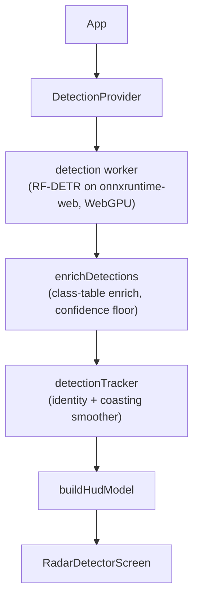

# dashradar: Technical Reference

## 1. What it is

A phone on a dash mount runs object detection on its rear camera and shows a full-screen signal meter styled like a radar detector. The camera feed is never drawn on screen outside a developer-only detection view (§10); a detection adds a small card with a cutout of what was seen. Everything runs in the browser: a Vite React SPA with no backend, no accounts, and no network traffic beyond the app shell and the model weights. It is a computer-vision detector, not a radar detector.

Inference runs in a Web Worker so it never blocks the video element. The app works offline once the model has downloaded, keeps the screen awake while scanning, and stays inside the thermal and battery budget of a phone clamped to a windshield in the sun. Deliberately absent: recording, history, sync, a backend picker (WebGPU or nothing, §2), and confidence numbers in the driver-facing UI. The only state surviving a reload is the cached weights and a small `localStorage` settings object.

## 2. Device support

Target: a modern iPhone on Safari or an Android phone on Chrome, landscape, dash-mounted. Desktop Chrome works for development.

**WebGPU is required and there is no CPU fallback.** Before anything downloads, the worker's `probeWebGpu()` requests an adapter, checks `shader-f16`, and creates a device; any failure raises the terminal `WEBGPU_UNSUPPORTED` before the camera ask and before a single model byte. The int8 CPU build that used to be the fallback measured 10+ second round trips where WebGPU takes about half a second; a detector scanning once every ten seconds misses most of the road, so turning the device away is the honest outcome.

The probe acquires a real device, in the worker scope, because some browsers expose the API on the main thread but not in workers, and some expose it and then fail device creation. It is posted separately from `load` so the verdict never waits behind anything the load waits for (§11).

`UnsupportedScreen` renders after the intro and before every camera screen. Nothing on it is fixable on the device in hand, so it is a handoff, not an error: it leads with "open it on another phone" and carries the `ShareTarget` cluster (QR plus Web Share). Its tests enforce the copy rules: never name "browser" or "GPU", never say "your phone" (the reader is holding the phone that failed), never ask for a "newer" phone (a current budget phone can fail where an older flagship passes).

## 3. Stack

| Concern | Choice |
| --- | --- |
| App | Vite 8 (Rolldown) + React 19, TypeScript, ESM, static build |
| Detection | `onnxruntime-web` on WebGPU in a Web Worker, hand-rolled preprocess and decode |
| PWA | `vite-plugin-pwa` (Workbox): precached shell, runtime-cached weights and ORT runtime |
| Styling | Tailwind CSS v4 on bespoke elements; Rajdhani the only font; `lucide-react` glyphs |
| Utilities | remeda, including the type guards that validate worker messages |
| Telemetry | Vercel Analytics and Sentry, gated on Do Not Track / GPC, off in dev |
| Tests | vitest + Testing Library (jsdom) |

Commands are in the [README](../README.md). `pnpm check` must pass before a commit.

## 4. Architecture

Everything below the provider is pure: no React, no DOM. Components read `useDetection()` and never touch the worker. Modules are directories named after their primary export (`index.ts` plus optional `consts.ts`, `types.ts`, `tests.ts`); contexts adapt engines to React (`DetectionContext`: a thin adapter over the detection engine; `SettingsContext`: gated settings), `lib/*` holds the React-free domain logic (the detection engine itself, detection filter and HUD shaping, per-result processing, telemetry, tracker, radar signal and audio, camera, crash sentinel, scan clock, and small single-purpose helpers), and `RadarDetectorScreen` is the driver-facing detection UI, with `DetectionView` its developer-only alternative that overlays the model's boxes on the live feed, and `CameraView` owning the hidden `<video>` element and subscribing it to `lib/camera`'s `cameraFeed` observable, which owns acquisition, playback, resize events, and teardown-by-unsubscription (the video is visible only through `DetectionView`). Never import `workers/detection/index.ts` from app code (it pulls in onnxruntime-web); import protocol types from `workers/detection/types`.

**The feed can be a file.** A video file dropped anywhere on the window, or picked from the settings Video file row, becomes what the detector scans instead of the camera. `VideoSourceContext` holds the selection and `VideoFileView` plays it through `lib/videoFileFeed`, another acquire-on-subscribe stream reporting the same `active` and `resize` events the camera feed does, so the pump only ever learns that some element is live. Both routes in are developer options, because the row is the only way back to the camera and a clip that could arrive without it would strand the session; the drop is still cancelled with the switch off, since refusing the drag hands the file to the browser, which navigates away from the app. A clip outranks the intro, the permission ask, and the camera error screens, which is what makes a machine with no camera, or a denied one, usable at all: a camera cannot be aimed at a patrol vehicle on demand, so a recorded drive is the only repeatable way to check the detector. State that belongs to one feed rather than to the session, the camera's failure and the element the preview mirrors, is stamped with a feed id the context mints per swap, so clearing a clip asks a refused camera again instead of putting its error screen straight back.

`useDetection()` hands out the engine's published snapshot (status, download progress, the `HudModel`, `scan` with the frame's raw per-frame detections and the tracker's coasted `tracks`, the current `contact`, an error code) plus `attachVideo(video)` / `detachVideo()` and `getDebugSnapshot()`. The debug snapshot is read on demand, never published: per-frame timing through state would re-render every consumer for numbers nobody is showing.

## 5. The frame pump

The pump lives in `lib/detectionEngine`, a framework-free rxjs stream graph the provider adapts to React through `useSyncExternalStore`. The engine's interface (a snapshot plus subscribe, inputs pushed in) is implementation-agnostic; swapping the internals from an imperative pump onto rxjs touched no consumer or test. Inputs, settings, and the active flag are `BehaviorSubject`s; `running$` derives from `active$` and `inputs$` with `combineLatest` and `distinctUntilChanged`, true exactly while a video is attached, the page is visible, and the settings panel is closed (the `settingsOpen` field on `inputs$`, not the separate `settings$` subject, which holds detection settings and plays no part in `running$`). Everything scoped to a run subscribes under `running$`, so a falling edge tears the run down by unsubscription, with no pause/resume protocol for a call site to hold.

A worker's lifetime is its own session observable: subscribing spawns and loads it, unsubscribing terminates it. `sessionLoop$` chains sessions end to end, `takeUntil(recycle$)` plus `repeat()` respawning a fresh one at a recycle boundary; a worker crash halts by flipping `active$` off, the same edge `deactivate` uses, so the next `activate` can start over. Each session's messages feed a shared handler, so an unsolicited result still gets filtered, tracked, and published, and that session's own pump: a sequential loop that captures a frame, posts it, awaits the reply, paces, and repeats, gated to start only once that session's `loaded$` fires.

**Structural invariants.** One frame in flight, no stale capture surviving a stop, and no frame handed to a still-loading worker are properties of the graph's shape, not counters: the loop never captures again before its one reply lands (its reply listener is subscribed before the frame posts, so even a synchronously answering worker is heard), a stop is unsubscription so a pending capture or pace timer simply dies, and the pump waits behind `loaded$` before its first capture. Two pieces stay imperative: `awaitingResult`, a flag scoped to one session's pump so a stop and restart landing while a reply is still outstanding resumes by waiting for that reply instead of posting a second frame, and `postedFrame`, the in-flight frame's geometry and timings, which its result reads because replies don't echo the frame they answer. A failed capture (typically a video with no frame data yet, mid-attach) retries quietly on a short delay forever, counting its consecutive-failure streak into the debug snapshot.

**Pacing.** Two rules compete after each result and the longer wins, in `pacingDelay`. The floor keeps captures at least `MIN_FRAME_INTERVAL_MS` (1 s) apart and governs fast devices. The rest keeps the GPU idle for a multiple of the work it just did and governs everything slower.

That multiple is not fixed, because what heats a phone is the share of wall time the GPU is busy rather than the milliseconds of idle between runs. Resting one round trip is 50% busy at any speed, so a fixed multiple gives a throttling phone more absolute cool-down while never reducing the load that made it throttle. Past `PACING_REST_RAMP_MS` the multiple climbs with the round trip toward `PACING_REST_RATIO_MAX`, which brings the duty cycle down to roughly a quarter as a device slows. `MAX_FRAME_INTERVAL_MS` bounds the result: the ramp buys heat with scan rate, and a detector scanning too rarely to catch what the car drives past is its own failure. The ramp starts exactly where the floor stops governing, so devices fast enough for the floor are paced as they always were.

Pacing is the app's main thermal defense; the coasting tracker and peak-hold meter make the slow rate acceptable to look at. Retune only with heat and battery testing on a real dash-mounted phone. The developer `throttleInference` off state drops the delay to zero; turning developer options off restores it.

**Scene-change gate.** Pacing decides how often to look; the gate decides whether looking would tell us anything. Stopped at a light or parked, the camera points at a picture that is not moving, and inference there spends a GPU-second per second re-deriving an answer that cannot have changed: nothing can enter the frame without changing the pixels in it. The worker measures that directly, from the ImageData it already reads off its input canvas, and answers `scan-skipped` instead of running the model. The measurement is per tile rather than frame-wide, because a patrol car at a distance worth warning about covers a few dozen of a 512x512 input's pixels and a frame-wide average cannot tell that apart from sensor noise; the frame-wide shift is subtracted first so an auto-exposure correction, which moves every tile alike and means nothing arrived, does not read as movement. The baseline is the last frame actually scanned, never the previous frame, or a scene creeping slower than the threshold per frame would never accumulate enough to trip.

A skip publishes nothing, leaving the tracker, the HUD, and the contact card exactly as the last real scan did, which is why it is its own message rather than an empty result: an empty result would coast the vehicle toward being dropped and decay the meter behind it. The engine, not the worker, decides when the shortcut has run too long, because only the engine can see a pause, a resume, or a recycle. It forces a scan on the first frame of every span and whenever `SCENE_GATE_MAX_SKIP_MS` has passed with nothing scanned. That bound is not optional. The gate's safety argument holds only as far as the threshold is calibrated and the frames are real, and a threshold set too high or a camera that has quietly frozen both look from inside the app exactly like a scene that is genuinely still, which would turn the gate into a detector that scans the road never while showing every sign of working. The developer `sceneChangeGate` off state forces every frame, which is what the gate gets measured against on a device; the debug overlay reports the measured per-tile shift on skips and scans alike, so the threshold can be read against both sides of the line.

**Capture shape.** What gets captured depends on whether anything needs the frame's original pixels. With the contact card on, the whole video frame is captured and the worker crops it. With the card off, which is the default, `createImageBitmap` is asked for the zoom crop already scaled to the model's input, so the bitmap that crosses to the worker is the input rather than several times it and the resample runs in the browser's scaler instead of a software downscale inside the worker. A pre-cropped frame carries the video's own size on the message, because a result's boxes describe the frame rather than the crop, and the worker refuses to cut a cutout from one. Both sides read the crop geometry from the same `centerCropRegion`, which is the one thing that must not drift.

**Periodic recycle.** Every `WORKER_RECYCLE_AFTER_MS` (15 min), at a result boundary, the pump fires `recycle$` and its session ends; `sessionLoop$`'s `repeat()` spawns the next one. This bounds native memory JS cannot observe or free (ORT arenas, GPU buffers, the wasm heap), which otherwise grows until iOS kills the page. Weights return from CacheStorage so no download UI flashes; the telemetry sink's one-shot gates keep recycles from re-firing analytics. The swap is cheap: measured on desktop Chrome with cached weights, a session rebuilds in roughly 250 ms and costs about one scan's worth of gap, so the interval is a memory decision rather than a thermal one. A reply watchdog shares the same path: a worker that answers a frame with neither a result nor an error within `WORKER_REPLY_TIMEOUT_MS` is wedged in a way `onerror` and the crash sentinel never see, so its session is recycled rather than awaited forever, reported once per page load as `worker_hung`. A load watchdog covers the stretch the reply watchdog cannot: from the moment the download is allowed (§11) until the session reports ready, some message must arrive every `WORKER_LOAD_TIMEOUT_MS` or the session is recycled the same way. The bound is on silence rather than load time, because a slow first-visit download posts progress with every chunk and must never be restarted for being slow, while a load wedged in CacheStorage or session creation posts nothing and would otherwise park the pump behind a ready that never comes, silently, for the rest of the drive.

**Pagehide teardown.** A departing page never runs React cleanups, so the engine ends its own activation on `pagehide`, terminating the worker synchronously. This is a memory defense, not tidiness: WebKit reuses one WebContent process across same-site reloads and reclaims a departed page's worker (its wasm memory, ORT session, GPU handles) lazily at best, so each reload otherwise stacks a dead page's residue onto the process until iOS kills whichever page is running at the per-process memory cap. A bfcache restore reactivates the engine (`pageshow`, scoped to a pagehide the engine acted on), so a cached return comes back scanning instead of holding a dead worker.

**Derived running state.** Whether the pump runs is never commanded, only derived: it runs exactly while a video is attached, the page is visible, and the settings panel is closed (a same-page overlay fires no `visibilitychange`, so it is an explicit input). The provider pushes those inputs; the engine acts on the edges of `running$`. The three resources that should exist only while scanning (the telemetry clock, the crash sentinel, the screen wake lock) are streams subscribed for exactly as long as the published status is `running`: each one's teardown is its own release, so leaving the scanning window cannot leave a heartbeat timer or a wake lock behind, whichever code path publishes the change.

**The wake lock has to be bought with a tap.** WebKit grants one only to a request made from inside a user gesture, and grants gesture-less ones afterwards only because such a request already landed on the document. The engine asks when scanning starts, several awaits past the tap that set the app going, so on iOS the lock was refused and stayed refused for the life of the page while Chrome, which has no such rule, granted it. Two paths cover it now. Each tap on the way to scanning spends a throwaway request to win the permission, and a refused lock waits for the driver's next touch of the screen and asks again, which is the only route left on a returning launch that shows neither the intro nor the permission ask. A grant that follows a refusal is reported under its own tag, so a session that recovered does not read as one that scanned with the screen free to sleep.

## 6. Worker protocol

Both directions are validated by type guards; a malformed message is ignored rather than crashing either side.

| Direction | Message | Purpose |
| --- | --- | --- |
| → worker | `probe` | Can this device run the detector? Downloads nothing; posted ahead of `load` |
| → worker | `load` | Download the given model's weights and create the session (an omitted model loads the default); posted once both of its waits are done, service-worker control in production and the owner's go-ahead (§11) |
| → worker | `detect` | Run one transferred frame, with the cutout flag, zoom, the effective threshold, the source size when the frame arrives pre-cropped, and whether the scene-change gate may skip it |
| → main | `model-load-start` | Whether weights came from cache; drives whether the download screen shows |
| → main | `model-progress` | Byte counts while streaming; not sent on a cache hit |
| → main | `model-downloaded` | Weights done, before session build, so download success is counted apart from session failure |
| → main | `backend-probe` | Session error, graph-capture state, isolation, thread count, and what the loaded weights say about themselves; feeds the debug overlay |
| → main | `ready` | Session is live, reporting what the checkpoint turned out to hold (head width, classes) |
| → main | `detections` | Decoded boxes, per-stage timing, optional extras |
| → main | `scan-skipped` | The frame matched the last one scanned, so the model did not run; carries the gate's cost and the shift it measured |
| → main | `worker-error` | A typed `DetectionErrorCode` plus optional detail |

The `detections` extra: the **cutout** (top detection's box, padded, clamped, downscaled, never upscaled) is the evidence the contact card shows, requested only while the detection-image setting is on.

`WORKER_CRASHED` is set by the engine from `worker.onerror` for exceptions the worker's try/catch missed. WebKit runs WebGPU in a separate process that can die under a healthy page; the worker awaits `device.lost` once per session and turns it into `GPU_DEVICE_LOST`, ignoring the `"destroyed"` reason (deliberate teardown, not a loss).

## 7. The model

A custom **RF-DETR Nano** checkpoint fine-tuned on Las Vegas Metro police vehicles, published at [`tuxracer/las-vegas-metro-rfdetr-nano`](https://huggingface.co/tuxracer/las-vegas-metro-rfdetr-nano) and exported from a sibling training repo. Signature: input `[1,3,512,512]` fp32 NCHW, ImageNet-normalized; outputs `dets [1,100,4]` (cxcywh, normalized) and `labels [1,100,2]` (raw logits). No NMS; RF-DETR is set-based.

Each release measures its own operating point and publishes it, so `CONFIDENCE_THRESHOLD` is read off the new release's notes on every checkpoint swap rather than carried across. It is rounded to the nearest tenth to stay on the developer confidence slider's grid, which moves in tenths.

**Built-in plus stored models.** `src/lib/detectionModels` defines the uniform shape every checkpoint entry takes: Hugging Face `owner`, `slug`, pinned `revision`, and repo-relative `file`. `BUILT_IN_MODELS` are the entries a build offers without anyone pasting anything, `DEFAULT_MODEL` first (the police checkpoint, `model_fp16.onnx`, ~54 MB) and a general-purpose COCO detector beside it; listing one costs nothing, since an entry names bytes to fetch and only the selected model is ever loaded. More can be registered from the model picker by pasting a URL, and those persist as full entries in `localStorage` under the `models` key. `knownModels()` is the built-ins plus whatever is stored, and is what a selection resolves against: resolving never yields nothing, since an id left by a build that had a model this one does not falls back to the default instead of asking for weights that do not exist. An entry says which bytes to fetch and nothing about what they hold: the head width and the class labels are read off the loaded session and the file's own stamped `names` map (§8), so no table here can drift from the weights it describes. The default keeps a stable id (`las-vegas-metro-nano`) so a routine revision bump still reaches a stored selection, and a swap to a genuinely different checkpoint takes a new id instead, so a stored selection is never silently repointed at a different detector. An added model's id is its own pinned weights URL, since nothing else about it is guaranteed stable.

**Adding a model from a URL.** The picker accepts a bare Hugging Face repo page or a `blob`/`resolve` URL pointing at an `.onnx` file, and any other https link that points straight at an `.onnx` file. Off Hugging Face there is no API to ask what a host holds or which revision a file is, so such a link is taken exactly as pasted: it has to name the file itself, a link to a page or a directory is refused before anything downloads, and the address is both the id and the pin, which means a host that serves changing bytes from one address keeps whatever the cache saw first. The weights cache route matches any `.onnx` path for the same reason, not just the Hugging Face host, and the download is an ordinary CORS fetch, so a host that does not allow cross-origin reads fails in the picker like any other bad candidate. Whatever revision the URL names is resolved to its commit SHA through the Hugging Face API before anything is stored, since the weights cache is keyed on URL and a mutable ref behind it would never update; a tag and a branch look the same in a URL and are both mutable, so only a URL that already names a commit SHA skips the lookup. A bare repo URL also asks the API which `.onnx` file to load. The add fails if the repo holds none; if it holds several, the picker lists them and the add waits on a choice, which costs one more read of the same revision metadata and saves someone hunting down the exact file URL to paste. The picked file is registered at the SHA that listing returned, so the choice needs no further lookup. Before an entry is stored, a throwaway detection worker gives it a full trial load: download the weights, build a WebGPU session, run it once. That download is the same one that fills the cache, so a successful trial has already cached the weights, and it is the same contract check a real load performs, so an incompatible checkpoint fails in the picker instead of stranding a driver after a reload. Success registers the entry and shows the classes the checkpoint reported; running it is a separate decision, taken from its row like any other model's. There is no save step anywhere on the screen, because the download the trial already performed is the commitment, and taking a model from its card confirms, writes the selection, and reloads on the spot.

**What the file says about itself.** An export can stamp provenance into the ONNX file (release tag, source model id, class names), and onnxruntime-web's JS API surfaces none of it: all a session exposes is its input and output names, types and shapes. `src/lib/onnxMetadata` reads those top-level fields out of the downloaded bytes instead, stepping over the graph by its declared length rather than parsing it, which keeps the read at a fraction of a millisecond on a 54 MB file. The result rides to the debug overlay on `backend-probe` and is the only way to tell which build a device is really running, since the URL says which revision was asked for and not which bytes a cache returned. A build exported before stamping reads fine and reports nothing.

**The model card.** A row in the picker opens that model's card rather than selecting it, so a choice is made after reading what the thing is: what it looks for, which version, and a link out to the repo page it came from. Choosing and removing both live there too, which leaves one tap target per row. The class list comes from a session that actually loaded the file, never from anything declared: the running model's from its live session and an added model's from the trial load that registered it, each class its own chip, all of them, since a general-purpose model names eighty and the point is to find one. A model neither has seen has no class list to show, which is the state everything in the picker starts in, so a built-in entry carries `summary`, one hand-written sentence about what the checkpoint is for. That sentence is the only thing about the weights this app declares, and it is prose: nothing decodes it, and running the model still fills the class list from the file.

The worker is told which entry to load on the `load` message, because a worker has no `localStorage` of its own to read the selection from. `DetectionContext` resolves it once at mount, hands it to the engine, and exposes it as `activeModel`, so a session and the worker it rebuilds every 15 minutes stay on one model for the whole drive. A new choice applies on the reload the model screen performs when a model is taken.

**Raw onnxruntime-web, not the Transformers.js pipeline.** The head is a sigmoid scored per class per query, real classes starting at logit index 1 (index 0 is an unused background slot); decode argmaxes each query over the logits the checkpoint names, one label per box. The head width comes from the `labels` output of the run every load already performs, and a `labels` output not shaped like a classification head at all throws `MODEL_LOAD_FAILED`. The pipeline's softmax-with-background decode drops every real detection regardless, and the matching image processor is not a registered JS processor. Any replacement model must be verified end to end in a real browser; there is no second execution path to catch a bad export.

**Mixed precision, GridSample fp32.** The export is fp16 with fp32 I/O and its three GridSample nodes held at fp32, because the WebGPU GridSample kernel emits a WGSL-illegal `f32 * f16` multiply for fp16 tensors and breaks detections silently rather than loudly. Those fp16 tensors are why the probe gates on `shader-f16`. [Models.md](Models.md) carries this and the rest of the contract a replacement model has to meet.

**Graph capture.** Records the first run's kernel dispatches and replays them, cutting the CPU cost of hundreds of small dispatches. Attempted on Chromium, falling back to a plain session on failure. It requires the native C++ WebGPU EP, which is why the worker imports `onnxruntime-web/webgpu`: the root import's JSEP registry has no TopK, this graph has one, so under JSEP that node lands on CPU and capture fails deterministically. `ORT_RUNTIME_FILES` in `vite.config.ts` must track the import.

WebKit skips the attempt entirely and runs a plain session, so the debug overlay's capture row reads "disabled" on an iPhone. The win capture buys is a Chromium one: measured iPhone round trips are about the same with it on or off, so the skip gives up nothing but the uniform code path, and iPhone crash volume rose while capture was attempted there. Read that correlation carefully rather than as settled cause. This exclusion has been added and retired twice before ([iPhone.md](iPhone.md)): the first version rested on crash attribution and was disproved by the full Sentry data, where the kills landed with capture on and off alike, and the second rested on the measured no-win and was retired as a user-agent branch guarding against nothing observed. What would lift it a third time is a measured WebKit speedup worth the risk, not merely the absence of a correlation.

**Startup sequencing.** Three changes from that crash cluster, all about not stacking peaks: the weights buffer is released before the first run, exactly when ORT allocates every intermediate at once (only once CacheStorage is confirmed to hold the bytes, since the fallback path re-reads them from there; a fresh download qualifies too, because the service worker's model-cache route stores the body as it streams); the plain session gets a warm-up run on zeroed input before `ready`, so the first-run shader-compilation storm does not land on the first real camera frame; and the camera is acquired only after status leaves `loading-model`, so `getUserMedia` never fires while the session compiles.

## 8. Detection domain

**Class table and threshold.** A class is a logit index and the label the checkpoint gives it. Nothing declares them: the table is built at load from the `names` map stamped into the weights, so the labels and the logits they index always come from one file. It never leaves the worker, since a logit index means nothing anywhere else. A detection travels as the label the checkpoint gave it and is drawn as that label; the HUD's uppercase register is a CSS `text-transform`, not a second string computed and carried alongside the first. The one rewrite is `NORMALIZED_CLASSES`, which folds labels that are one thing to us ("car" and "truck" both surface as "vehicle") at enrichment: the model wavers between the two on a single vehicle, a label change is an identity change to the class-gated tracker, and each waver minted a fresh track id. Everything downstream sees only the folded name, and the scene view places "vehicle" with the car glyph. The fold also enables a same-frame dedupe: the head scores classes independently, so a torn model can fire overlapping car and truck queries on one vehicle in a single frame, and only once both read "vehicle" can the pair collapse to the strongest box (`DUPLICATE_IOU_THRESHOLD`) instead of spawning a parallel track that trades ids and colors with the original. A file that names nothing gets generic per-slot labels rather than a failed load, since the meter reads scores and only the words would be missing. The width they are read against is measured off the session's own `labels` output for the same reason.

Everything a checkpoint names is shown. There is no allowlist, which stopped making sense once the checkpoint was trained in-house: discarding a class we deliberately trained is a bug, not a filter. That does mean a new class is live the moment it is named, since `hudSignal` takes the max score across every detection regardless of class. `CONFIDENCE_THRESHOLD` (0.7, near the shipping checkpoint's measured operating point) is applied in the worker's decode and again defensively when detections are enriched; both take it as a parameter, so the developer slider changes both without a worker reload. `SIGNAL_FLOOR` and the value the confidence slider reports while Developer options is off are that constant rather than copies of its number, so neither can drift from the floor the detector actually filters at.

**Own-hood filter.** A dash mount keeps the driver's own hood in every frame, and the model rightly calls it a car, so `isOwnHood` drops it by geometry alongside the confidence floor: a box spanning nearly the scanned region's full width, staying short, and running off the region's bottom edge is the hood, whatever class it was given. Everything is measured against the scan region rather than the frame, because on a landscape frame the model sees only the centered square and a box spanning "everything" is nowhere near full-frame width. The bottom edge is the strongest discriminator: a wide vehicle ahead is bottom-pinned too but tall, and anything wide and short at range stands on visible road. Filtered this early, the hood never reaches the tracker, the meter, the contact card, or the scene view.

**Coasting tracker.** Shows every detection immediately and only smooths flicker. Matching scores each detection against every same-class track's velocity-extrapolated box (IoU blended with a size-scaled nearness term), claims the strongest pairs first, and accepts against a threshold that relaxes the longer a track has gone unseen, since a second or more between scans moves a real vehicle too far for its stale box to overlap its new one. A matched track adopts the new box but eases its score toward the new value (damping jitter the meter's floor remap would amplify); an unmatched track coasts for `MAX_COAST_MS` after its last match; an unmatched detection is visible at once. Matching never crosses classes, because a track's id claims the same object is still there and an object does not change class; a different-class box in the same place is a new contact, not the old one relabeled. The coast budget is elapsed time, not a count of results, because results arrive anywhere from once a second to once every five depending on pacing, and a counted coast would keep a vanished vehicle driving the alert several times longer on exactly the hot, slow-scanning device that pacing is protecting. A pure step function plus a small stateful factory, unit-tested directly. Each object gets a GUID and a display color at first sighting (the color seeded from the id via `randomcolor`, minted once and stored on the track rather than recomputed per scan) and keeps both for as long as its track lives; the engine publishes the tracked set as `scan.tracks`, and that identity is what lets the scene view glide one object between fixes instead of re-creating it every scan. [Tracking.md](Tracking.md) covers the matcher in detail and the follow-ups held back until real drives demand them.

**Detection streams.** The engine also exposes each scan as two rxjs streams: `rawDetections$`, the frame's filtered detections before identity, and `identifiedDetections$`, derived from it, the same detections each carrying its object's id plus the coasted track set. The derivation is shared, so the tracker steps once per scan however many consumers subscribe, and the snapshot the HUD renders is built from the same emission the streams deliver; a future consumer inferring more about a detection keys on the same ids the UI shows.

Zoom (a developer option offering a fixed 1x or 2x crop) is a digital crop, never an upscale: `CAMERA_CONSTRAINTS` asks for ~1024 per axis so the 2x crop lands at 512 native pixels, and any new zoom level must be gated on the granted stream's real dimensions. Native camera zoom is not an option (iOS Safari does not expose it; Chrome Android reports device-defined units). The constraints also cap the frame rate (ideal 15), roughly halving steady capture power against the 30 fps default; not lower, because auto-exposure stretches shutter time toward the frame period and long shutters blur exactly the night frames the model needs sharp.

**HUD shaping.** `buildHudModel` computes `top`, the highest-scoring detection, which the dial's percentage and the status word's class name both read. The contact card and its direction readout instead come from the worker's own score-based pick (`topDetectionIndex`). Both pick by score but read different data, the card the raw detections of the frame just decoded and the dial the coasted tracker set, so they agree on a live frame and drift apart while a track coasts. `mapBoxToViewport`, from the same HUD, maps both `scanRegionBox` (the model's centered crop, narrowed by zoom) and each box for the detection view, assuming `object-fit: contain`. The detection view fits the feed rather than filling the screen with it, so a box near the edge of the frame is on screen to be checked instead of in the margin a `cover` render crops away.

## 9. UI

One opaque full-screen instrument, dark only, amber the single accent, Rajdhani throughout. Landscape-first, the intro the deliberate exception (a first-time user holds the phone in their hand). No nav, no dialogs.

**The meter** is a tachometer-style arc of ticks around a percentage readout and a status word. While the meter holds a contact the word names the detected class (`<CLASS> DETECTED`), falling back to `ALERT` for a signal with no class to name, and holds that class through the dial's decay tail since the raw signal clears before the peak-held meter does; below `CONTACT_THRESHOLD` it reverts to `SCANNING`. The peak-hold decay, held-label rule, and threshold gates are a pure per-frame step (`stepMeter` in `radarSignal`, unit-tested directly); a `requestAnimationFrame` loop applies it and writes straight to the DOM, so smoothness never depends on the detection rate. The loop parks itself once the meter is quiescent and is woken by change; while awake, DOM writes are skipped when nothing changed.

**The contact card** sits beside the dial in landscape, below in portrait: a canvas-drawn cutout above a direction row (left / ahead / right), no label or percentage since the dial carries the number. The direction row only renders while the raw signal is nonzero, so a card lingering through the decay tail never shows a stale heading; visibility uses delayed-visibility CSS rather than opacity alone so it stays tappable through the fade-out.

**The scene view** is the second driver-facing view: detected objects placed on a fogged ground grid in ego-relative meters, toggled from a status-bar button beside the gear (the persisted `viewMode` setting; the developer detection view overrides both). Range comes from a per-class real-height prior through a pinhole model in `scenePlacement` (pure, unit-tested): the similar-triangles ratio gives axial depth, lateral offset derives from it, and the one unknown is the camera's field of view, the `sceneFov` calibration below. The priors are a strict allowlist on purpose, since a label with no known height has no distance, and the glyphs are assembled from a handful of flat-shaded boxes and cylinders rather than modeled, giving each kind a silhouette a driver can name at a glance without claiming precision the placement does not have: range is only good to tens of percent, while bearing is nearly exact. Rendering is react-three-fiber on a demand frameloop: glyphs glide to each new fix and fade in and out with what the latest scan actually found. Nothing coasting is drawn: the tracker holds an unmatched track so the meter and the contact card ride out a single missed detection, and a glyph standing on a ground plane cannot borrow that, because it is a statement about where something is right now. The animator re-invalidates only while a tween or fade is unfinished, and a static scene draws no frames at all, which is what makes an always-visible 3D view compatible with the thermal budget. The one animation that never finishes is the police lightbar, flashing red and blue: a strobe is a step function rather than a tween, so it runs on a cadence in milliseconds and costs one frame per flip, five a second, only while a patrol car is on screen, and it holds steady under reduced motion. No light is actually cast, and none can be, since every glyph draws with an unlit material and the ground is grid lines rather than a surface; the halo over the bar and the pool of color on the road are painted geometry that changes color with the lit lamp. The view owns its own beeper on the same raw-signal contract as the meter. It is also the only screen that follows the phone's light or dark appearance, read live so a phone that switches itself at dusk switches the scene with it: a light setting puts the scene on a white ground, with the fog following it and the grid darkened to stay visible. Everything else stays a dark instrument either way, so the wordmark, view toggle, and gear drawn over the scene switch to dark ink through a variant scoped to this view rather than a query of their own. An orientation rig pans the chase camera with the phone's physical attitude (clamped yaw and pitch, roll dropped), its neutral adapting over a few seconds so a skewed mount or a long curve never holds an offset; a smoothing dead band means a vibrating mount costs no frames, and where orientation events never fire the camera just holds its base framing. WebKit keeps those sensors behind an ask only a gesture can make, and nothing on the way in is one (the camera prompt is the browser's own, and a driver returning to the remembered view taps nothing), so the view asks on whatever the driver first touches and also offers a pill that supplies the tap outright, for the dash-mounted phone nobody touches at all. Both go away for good on the first reading or the driver's answer, whichever comes first, and neither ever appears on a phone whose sensors were open to begin with. A lost WebGL context waits for the browser's restore, then remounts the canvas once, then falls back to the radar view by reverting `viewMode`, so the toggle never claims a view the screen is not in.

**The beeper** belongs to whichever driver-facing view is mounted, through the shared `useRadarBeeper` hook, so leaving a view tears its audio graph down. It is fed the *raw* signal rather than any peak-held or smoothed level, so beeps stop the instant a detection clears while the dial decays behind them, and the audio-alerts row off feeds silence rather than stopping, so a beeper mid-alert falls quiet instead of holding its last state. Cadence comes from repeated calls at a steady level, which is why the hook runs an animation-frame loop of its own; it parks the moment it feeds silence and is woken by a change to either input, so quiet scanning schedules no frames.

Other surfaces: the status bar (wordmark, view toggle, settings gear, optional slot for the zoom and round-trip pills), the debug overlay, the model load screen (delayed to avoid a flash; DOWNLOADING and PREPARING phases), the error screens, the camera permission ask (so the browser's own prompt never lands unexplained; the camera is requested only after the ALLOW CAMERA tap), and the intro with its Canvas 2D night-drive scene. Intro dismissal persists as a version number, so bumping the constant walks returning users through a reworked intro once.

## 10. Settings

`localStorage`, validated on read: a corrupt blob falls back to defaults entirely, a partial one fills missing fields from defaults, so a build that adds a field cannot wipe stored values.

`developerOptions` is the master switch, and it sits on a screen of its own reached from a row in the settings panel, with everything it gates listed beneath it. Nothing a driver would want is behind that row, so the panel stays short and the developer rows get to be named in the words this codebase uses rather than plain ones. While off, `SettingsProvider` reports every developer option at its off value, so consumers read an already-gated value and never repeat the gate; stored values are untouched, so re-enabling restores prior tweaks. **Turning the switch on reveals rows and nothing else**: every developer option starts at the value a normal drive already runs at, so the switch changes no behavior by itself (a settings-version migration turned off the ones that used to default on). Do not add one whose revealed state differs from the state it gates.

`viewMode` (radar or scene) is user-facing but has no settings row: the status-bar toggle is its only control, and scene render failure writes it back to radar rather than holding a session-local override, so the stored value never disagrees with the glass.

The panel itself holds only driver-facing rows: **Audio alerts** gates the beeper (beeping while the dial shows nothing is impossible by construction; the audio floor sits at or above the dial's contact threshold), **Detection image** (default off) turns the contact card off end to end when disabled (the worker is told not to cut a crop, not just the UI hiding one), plus the row that opens the developer screen, which is never itself gated or there would be no way to reach the master switch.

**Detection model** is the first row that switch reveals, and it opens the picker below (the row names no model: a repo slug does not fit the space beside a row's label, and the picker names it properly). `modelIds` is the one developer row whose setting is *not* gated, and deliberately: the picker applies a choice by confirming it and reloading, so a chosen model keeps running when the switch goes off rather than being quietly reverted on the next load. The panel owns the whole screen stack, so backing out of the picker lands on the developer screen that opened it.

Developer rows with real behavior behind them: **Video file** picks the clip to scan instead of the camera, and holds the only way back to it; the drop gesture it mirrors is gated with it, and switching developer options off returns a running clip to the camera, since the row that would clear it goes away. On a phone, which has no drag gesture to offer, this row is the whole feature. **Skip still frames** turns the scene-change gate off so every frame reaches the model, which is how the gate's effect on heat and on detections gets measured on a device. **Camera preview** plays a second video element cropped to exactly the scanned region, for checking aim; it defaults off because a second live surface costs compositing on a thermally constrained device. **Detection view** swaps the meter for the live feed with the model's boxes drawn over it, for checking aim and false positives against what the detector actually sees; replacing `RadarDetectorScreen` takes its beeper and contact card off with it too. **Scene FoV** is the scene view's one calibration scalar, the camera's horizontal field of view: every class shares the same lens, so trimming this slider against one object at a known distance calibrates every range at once. **Reset app data**, behind a confirm, empties both web storages, deletes every cache and IndexedDB database, unregisters service workers, and reloads, each step settling independently so one failure cannot strand the app half-cleared; it reproduces a genuine first visit on a phone, where devtools are not an option.

## 11. Offline and PWA

Workbox via `vite-plugin-pwa`, registered with `autoUpdate` (silent background updates). Offline works through the **app shell precache** (every built file, including the detection worker's chunk) plus two `CacheFirst` runtime caches: `model-cache` for the weights (the worker streams the download itself to report progress; Hugging Face 302s to a signed CDN URL but Workbox keys on the stable request URL) and `ort-runtime` for the ORT wasm, served same-origin from `/ort/` by a small Vite plugin and fetched on first use rather than precached, to keep ~24 MB out of the service-worker install.

**Model caching pins a revision.** The route is keyed on URL, so the model URL pins an explicit revision, never `main`. To ship a new model: push a new tag, confirm the URL returns 200, bump the revision constant.

**Updates settle before the camera asks.** iOS forgets camera permission between launches of an installed web app, and `autoUpdate`'s reload used to land seconds after the driver answered the prompt, forcing a second answer. `CameraView` now also waits on `waitForUpdateSettled`: an explicit update check that resolves when the launch is current (usually inside the model load, so it costs nothing) and holds while a found update installs, letting the reload arrive first so the driver is prompted once. Both the check and the hold are bounded (`UPDATE_CHECK_TIMEOUT_MS`, `UPDATE_PENDING_TIMEOUT_MS`) and every failure path resolves, so the worst case is the old double prompt, never a stalled startup.

**First-visit caching needs the service worker in control.** The model fetch runs inside the worker, which can start before the service worker claims the page, and that first fetch would bypass the route and store nothing. So `load` waits for `navigator.serviceWorker.controller`, bounded by a short timeout, production only; dev has no service worker, so the worker caches the weights itself into a dev cache. `requestPersistentStorage()` is called on startup so the browser is less likely to evict the weights.

**The download runs under the intro, except on a desktop.** Fetching the weights is the longest part of a first visit, and the intro is the one stretch of the app with nothing else to do, so on a phone `DetectionProvider` mounts and the download starts while the intro is still being read. A desktop is the exception: what it gets instead of a START button is the QR handoff to a phone, so tens of megabytes for a machine that is about to pass the app along is bandwidth spent on nothing. There the engine is built with `deferModelLoad` and `App` calls `allowModelLoad()` once the intro is no longer what the screen shows, which covers both the continue-on-this-device link and a returning visitor who is shown no intro at all. Only the download waits: the GPU probe goes out at mount either way, so an unsupported device is turned away on its own schedule. The load watchdog (§5) starts when the download is allowed rather than when the session is created, since a load held back on purpose is silent by design and would otherwise be recycled as wedged every minute the intro is up.

**Cross-origin isolation.** COOP `same-origin` plus COEP `require-corp` (from `vercel.json` in production, Vite config in dev) enables `SharedArrayBuffer`, which lets the ORT wasm runtime run multi-threaded; without it ORT silently clamps to one thread. Inference is on the GPU, but the runtime hosting the WebGPU EP is itself wasm and runs any node the EP cannot take. `require-corp` beat `credentialless` for Safari support, viable because nothing needs an exemption; a cross-origin script or `no-cors` fetch will be blocked.

Verify in a real browser: after a fresh load, Cache Storage holds the precache plus both runtime caches, and an offline hard reload cold-loads the app and runs live inference with no network requests.

## 12. Telemetry

Anonymous, no camera, location, or detection geometry; dev builds emit nothing. With no backend, these events are the only view into whether the app works on real devices. All fire from the worker-message handlers at their source, never from render or state updaters.

| Event | Says |
| --- | --- |
| `intro_start`, `camera_prompt_*`, `settings_open`, `share_click`, `reset` | Funnel and UI steps; `reset` separates a wiped install from a fresh one |
| `model_picker_open`, `model_switch`, `model_add`, `model_add_failed`, `model_remove` | What people do with the model picker: whether they look, what they run (`from`/`to`), and how often a pasted checkpoint survives its trial load (`source: huggingface \| url`, plus the class count on a success and the code on a failure). A built-in is named by its slug; anything added is `custom`, and no pasted address or trial-load message ever travels, since both are the person's own and can name a private host |
| `model_downloaded` | Weights finished streaming (slug, revision, duration); real downloads only |
| `model_ready` | Session up, and whether from cache; first `ready` of the page load only, so recycles do not re-fire it |
| `first_inference`, `first_round_trip` | End of the funnel: one frame scored, cold |
| `scan_session` | Actual scan time per drive, bucketed, plus installed-PWA state; the denominator for everything else |
| `wake_lock` | Whether the platform granted the lock (`succeeded`/`failed`, with a reason on a failure and `source: gesture` on a grant the tap retry won); the screen sleeping mid-drive is the app's worst silent failure, and the grants are what the refusals are read against. One refusal and at most one grant per page load |
| `worker_hung` | A worker went silent (mid-scan or mid-load) and was recycled to recover; once per page load |
| `pwa_installed` | Chromium's install event, or first standalone launch on iOS |
| `app_updated` | The first launch on a new build, `from` and `to` commit SHA; counts updates that were actually run, not ones downloaded |
| `error` | Every failure that reaches the user, by code |

Timing values are bucketed to the nearest half second, so jitter collapses and a reading says how fast a device is rather than carrying noise. `scan_session` reads a clock measuring scanning time, not page time: every pause stops it, and reads claim what they report, so stretches sum to the total with nothing double-counted.

**Crash sentinel.** iOS sometimes kills the page mid-scan with no JS running at kill time, so Sentry never sees it. While scanning, the app writes a heartbeat to localStorage and clears it on every clean exit, including a synchronous `pagehide` path (React never flushes effect cleanups during unload, and the auto-updating service worker reloads sessions routinely). Only a real OS kill leaves a stale record; the next launch classifies it by gap length (short: crash, since iOS relaunches a killed foreground tab within seconds; long: unclean shutdown). A worker error that halts scanning is deliberately not a clean exit: the record stays armed and beating on the error screen, its log ending in that error (a GPU device loss carries its bounded reason, never the platform's message), so a page killed moments after its GPU process dies still names the loss at the next launch; pagehide and the next activation clear it as usual. For tethered Web Inspector work, the Console diagnostics developer row mirrors the session log to the console live, with scan lines carrying the wasm heap, the owned-bitmap count, and the frame number; a dirty end is also always replayed to the console at the next launch, because an OS kill takes the dead process's inspector console with it. The heartbeat runs fast for the first 30 s of scanning and slow after, because every field kill so far landed within ~21 s of the pump starting and a flat slow cadence could not resolve where in startup the page died. Each beat also stamps the view on screen and the running model, both read at the moment of writing rather than when the session started, and a view switch forces a beat of its own so a crash seconds after one is not filed against the view it left.

**What a report can be asked about.** Only tags can be grouped and filtered, so the fields a question gets asked of are tags and the rest is attached detail. Outcome, graph capture, the writing build, the view, the model, and the recycle count are tags; the raw gap, uptime, the two frame counts, the worker's age, the outstanding bitmap count, and the wasm heap size stay attached, since a value distinct for every session can only ever answer for one of them. The heap size is the runtime's wasm heap as of the worker's last reply, written down because the kill it explains (iOS ending the page over its per-process memory limit) runs no JS and leaves no other record of how big the heap had grown. The counts are split because a round trip is not necessarily a scan: `framesProcessed` counts every turn of the pump and `scansProcessed` the subset that ran the model, so the gap between them is what the scene-change gate answered for free. Reported as one number, a session that skipped its way through twenty round trips reads as twenty inferences of GPU work it never did. `framesProcessed` keeps counting both rather than narrowing to real scans, because reports already in hand were written under that meaning. **The session log.** Each beat also carries the last `MAX_SESSION_EVENTS` things the engine did (a scan and its round trip, a gate skip, a model load, a recycle, a view switch, the video attaching or detaching, a worker error), replayed as breadcrumbs on the report at the next launch. It is what turns "died at 8.0 s" into "died 340 ms after switching to the scene view". Entries carry `Date.now()`, not `performance.now()`, since the reader is a different page load. Everything except scans and skips also forces a heartbeat: those two arrive about once a second and would double the write rate for entries the next beat collects anyway, while the rest are rare deliberate moments whose timing is the reason the log exists, and an entry never written down is lost exactly when the page dies right after it. The cap is what bounds the record, since the whole log is rewritten on every beat.

Two more fields separate a kill from the machinery around it: the worker's age against `WORKER_RECYCLE_AFTER_MS` says whether one landed near a teardown and rebuild rather than in steady scanning, and the count of ImageBitmaps the page still owned rests at 0, or at 1 while a contact is on screen, so a number climbing past that is the per-frame leak an out-of-memory kill arrives as. Uptime is the exception that gets both: the raw number attached and a bucketed label as a tag (`UPTIME_BUCKETS`), which is what turns "did crashes move earlier in this build" into a chart instead of a stack of reports read one at a time. A model reaches a tag under the same rule the analytics events follow, a built-in by its slug and anything added as `custom`, because an added model's identity is a URL someone pasted and can name a private host.

**Install id.** Every Sentry event carries a random per-install identifier, kept in localStorage and reported as the user id. Nothing about the device or the person goes into it. It exists because reports with no identity all count as zero users, which leaves five relaunches on one handset looking exactly like five handsets failing once, and those are opposite conclusions about how bad a fault is. It is minted only once reporting is known to be allowed, so a visitor who has opted out never has one written, and clearing site data or resetting the app mints a new one.

## 13. Error handling

Typed error classes with a machine-readable `code`, never string-matched messages.

**Camera** (`getUserMedia` failures, mapped in `lib/camera`): `NotAllowedError`/`SecurityError` → `PERMISSION_DENIED`; `NotReadableError`/`AbortError` → `CAMERA_IN_USE`; `NotFoundError`, `OverconstrainedError`, and anything else → `NO_CAMERA`; a missing `mediaDevices.getUserMedia` → `UNSUPPORTED`, thrown before any call.

**Detection**: `WEBGPU_UNSUPPORTED` (probe failed; terminal, before any download), `MODEL_LOAD_FAILED` (download or session creation threw; no second backend to retry on), `INFERENCE_FAILED` (one frame threw), `GPU_DEVICE_LOST` and `WORKER_CRASHED` (§6).

Each code maps to a headline, body copy, optional reassurance rows, and a glyph. Every error screen offers a full page reload as its exit; no soft in-app retry. `MODEL_LOAD_FAILED` gets a second action when the failing selection was not the default, since retrying the same load would just fail again: it commits the default selection and reloads. `WEBGPU_UNSUPPORTED` is excluded from the type the error screen accepts, so routing it into the generic panel is a compile error rather than a lookup that finds no copy.

## 14. Testing

Vitest and Testing Library, behavior-focused. jsdom has no camera, no real worker, no WebGPU, and no layout engine, so those seams are stubbed or injected: unit tests cover the pure detection helpers, tracker, camera error mapping, the worker's preprocess and decode against known inputs, the message guards, the scan clock, the full status machine and pump invariants against an injected fake worker, and settings persistence and gating.

A real browser (chrome-devtools against a built preview) verifies the model load screen, the GPU probe, first-visit caching, offline cold load, graph capture, and reference-image scores after any model change. Only the user can verify on-device: real camera video, sustained frame rates in traffic, both orientations, and thermal and battery behavior on a dash mount.

## 15. Acceptance

1. On a phone, the app asks for the rear camera and shows the meter; the feed is never displayed outside the developer-only detection view.
2. A detection lights the ladder and readout, names the class in the status word, and shows the contact card with cutout and direction.
3. Without usable WebGPU, the intro still plays and START lands on the unsupported screen: no camera prompt, no download, no retry.
4. Permission denial, no camera, camera in use, and an unsupported browser each get their own explanatory screen.
5. A load failure or inference crash shows an error screen with a working reload.
6. The screen does not sleep while scanning, and the wake lock re-acquires across visibility changes.
7. After the first load, the app cold-loads and runs live detection fully offline.
8. `pnpm test` and `pnpm check` are clean.
